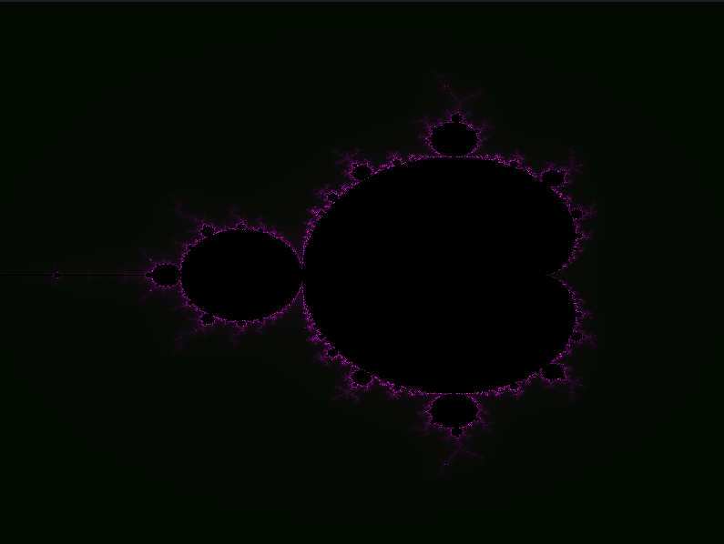

# Mandelbrot Visualizer



A simple Mandelbrot set visualizer written in **C++** using **SFML**.

This project was created to explore complex numbers, fractals, and pixel-based rendering. Each pixel of the window represents a point in the complex plane, and the program determines whether that point belongs to the Mandelbrot set by iterating the formula:

```
z = z² + c
```

where `c` is the complex coordinate represented by the pixel.

## Features

- Generate a Mandelbrot fractal in real time
- Custom complex number implementation
- Pixel-by-pixel rendering using SFML textures

## How it works

For every pixel on the screen:

1. Convert the pixel coordinates into a complex number `c`.
2. Start with `z = 0`.
3. Repeatedly apply:

```
z = z² + c
```

4. If the value of `z` escapes beyond a radius of 2, the point is considered outside the Mandelbrot set.
5. The number of iterations before escaping is used to generate the pixel color.

## Requirements

- C++17 or newer
- SFML 2.x / 3.x

## Build

This example assume you have `g++` & `SFML 2.5` or higher installed on your machine:

```bash
make run
```
or

```bash
g++ main.cpp -o mandelbrot \
    -lsfml-graphics
```

## Controls

_Currently no interactive controls._

Future improvements may include:

- Zooming and panning
- Dynamic rendering
- Color palette customization
- Multithreaded rendering
- GPU acceleration with shaders

## License

This project is for learning and experimentation purposes.
